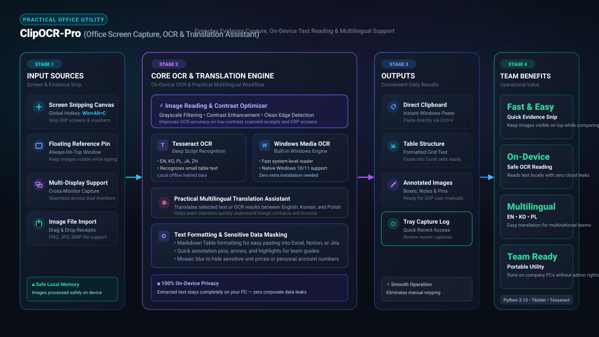

*Przeczytaj w innych językach: [English](README.md), [한국어](README.ko.md), [Polski](README.pl.md)*

# 📸 ClipOCR-Pro: Przechwytywanie ekranu, wielojęzyczny OCR i asystent tłumaczeń

  

  

> **Wygodne zrzuty dowodów · Lokalny OCR bez chmury · Szybkie tłumaczenia (PL/EN/KO)**

**ClipOCR-Pro** to poręczne narzędzie wspierające codzienne operacje biurowe, przeznaczone dla zespołów zajmujących się weryfikacją dokumentów, uzgadnianiem danych oraz współpracą międzynarodową.

W codziennej pracy administracyjnej i finansowej pracownicy często tworzą zrzuty ekranów ERP, potwierdzeń bankowych i faktur, aby wyjaśniać wątpliwości, porównywać kwoty lub przygotowywać instrukcje. Program pozwala szybko zaznaczyć obszar, odczytać tekst z obrazu (OCR) bez konieczności ręcznego przepisywania oraz przetłumaczyć treść (polski, angielski, koreański), ułatwiając codzienną pracę zespołową.

## Główne funkcje

- **📸 Przechwytywanie obszaru ekranu**: Zaznacz dowolny obszar za pomocą skrótu klawiszowego i zachowaj go jako pływające okno referencyjne zawsze na wierzchu.
- **🖍️ Szybkie adnotacje**: Dodawaj ramki, zakreślenia, strzałki, numerowane znaczniki, notatki tekstowe oraz mozaikę (zamazywanie) dla danych wrażliwych.
- **🌐 Tłumaczenie zaznaczonego tekstu**: Błyskawicznie tłumacz zaznaczony tekst przy użyciu skonfigurowanego przepływu pracy Google Translate.
- **🖼️ Tłumaczenie obrazów**: Wysyłaj zrzuty do Tłumacza Obrazów Google w przypadku zagranicznych faktur, skanów i załączników.
- **🔤 Lokalne OCR**: Wyodrębniaj tekst bezpośrednio z pływającego zrzutu bez wysyłania obrazu na zewnątrz. Tryb automatyczny najpierw używa Windows OCR, a w razie dostępności zatwierdzonego środowiska Tesseract.
- **📐 Zmiana rozmiaru i kopiowanie**: Dopasuj szerokość zrzutu (od 400 do 1600 px) przed wklejeniem do wiadomości e-mail lub raportu.
- **📧 Szacowanie rozmiaru wiadomości Outlook Web**: Oszacuj rozmiar tworzonej wiadomości w MB na podstawie zawartości schowka oraz nagłówków.
- **🖥️ Obsługa wielu monitorów**: Pełne wsparcie dla konfiguracji wielomonitorowych w środowisku biurowym.

---

## 🚀 Pobieranie i instalacja

**ClipOCR-Pro** jest dostarczany jako wygodny instalator **One-Click Installer**.

### 📥 Dla użytkowników (Instalacja jednym kliknięciem)

1. Przejdź do zakładki **[Releases](https://github.com/KwangBeomPark/01_ClipOCR-Pro/releases)** w repozytorium GitHub.
2. Pobierz plik instalacyjny bieżącego wydania: **`App01_ClipOCR-Pro_Setup_vX.Y.Z.exe`** (wraz z towarzyszącym plikiem manifestu JSON i sumą kontrolną SHA-256).
3. Uruchom pobrany plik instalacyjny (domyślna ścieżka instalacji: `%LOCALAPPDATA%\Programs\ClipOCR`, nie wymaga uprawnień administratora UAC).
4. Po instalacji na pulpicie i w menu Start pojawi się skrót, a ikona aplikacji w zasobniku systemowym Windows (Tray) będzie gotowa do użycia.

### 🛠️ Dla zaawansowanych użytkowników i programistów (Kompilacja ze źródeł)

1. Zainstaluj [AutoHotkey v2](https://www.autohotkey.com/) wraz z Ahk2Exe.
2. Sklonuj to repozytorium na dysk lokalny.
3. Uruchom `./scripts/build.ps1` w celu weryfikacji i przygotowania kompilacji.
4. Publikacja wydań odbywa się zgodnie z procedurą opisaną w [RELEASE_CHECKLIST.md](RELEASE_CHECKLIST.md) z zachowaniem podpisu cyfrowego Authenticode oraz weryfikacji sum kontrolnych SHA-256.

---

## ⌨️ Główne skróty klawiszowe

| Skrót | Funkcja |
| :--- | :--- |
| `Win + Przeciągnięcie myszą` | Przechwycenie wybranego obszaru ekranu i wyświetlenie go w oknie na wierzchu |
| `Win + CapsLock` | Tłumaczenie zaznaczonego tekstu (Google Translate) |
| `Ctrl + Win + 0` w treści Outlook Web | Szacowanie rozmiaru wiadomości (MB) bez załączników |
| Prawy przycisk myszy na pływającym oknie | Menu kontekstowe (tłumaczenie obrazu, adnotacje, kopiowanie, zapis, opcje) |
| Prawy przycisk → `Wyodrębnij tekst (Lokalne OCR)` | Lokalne wyodrębnienie tekstu i otwarcie okna wyników z możliwością kopiowania |
| Podwójne kliknięcie na oknie | Zminimalizuj / przywróć pływające okno |
| `Ctrl + C` na oknie | Skopiuj obraz do schowka |
| `Ctrl + 0` na oknie | Zapisz oryginalny rozmiar jako domyślny i skopiuj obraz |

---

## 🔒 Bezpieczeństwo i prywatność

- Funkcja **Lokalnego OCR** przetwarza obrazy w całości na komputerze użytkownika bez przesyłania danych przez sieć.
- Tłumaczenie zaznaczonego tekstu oraz tłumaczenie obrazów korzysta z usług Google Translate — należy zachować ostrożność przy poufnych danych firmowych.
- Program nie wymaga uprawnień administratora i zapisuje swoje ustawienia w profilu użytkownika `%LOCALAPPDATA%`.

---

## 📄 Licencja

Ten projekt jest objęty licencją MIT. Szczegółowe informacje znajdują się w pliku [LICENSE](LICENSE).
